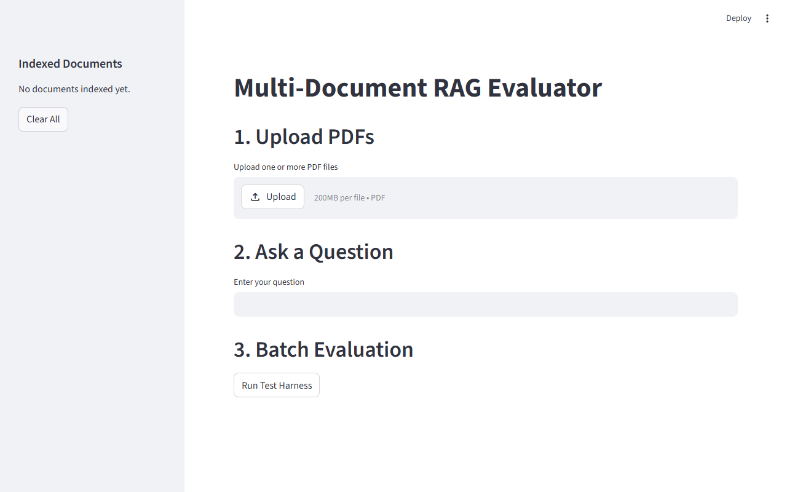
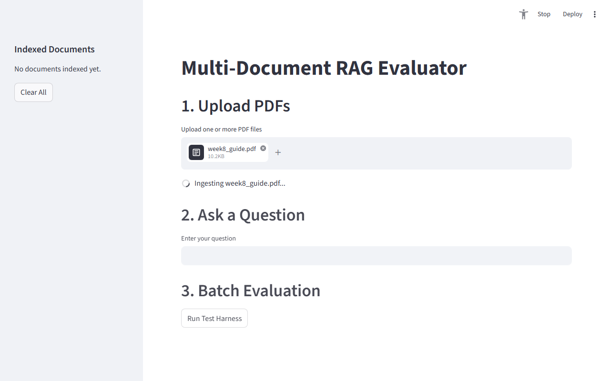
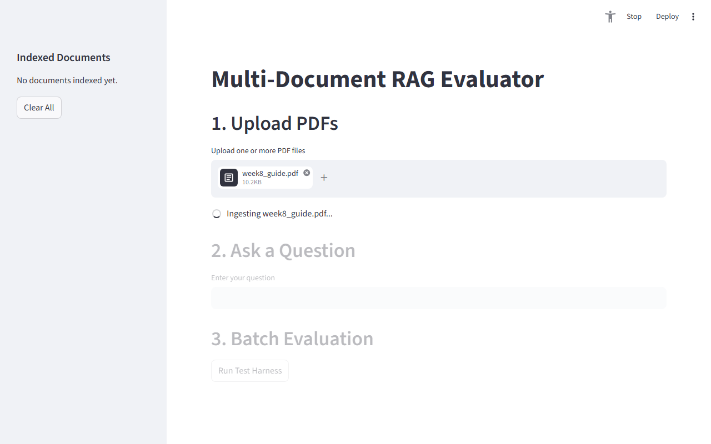
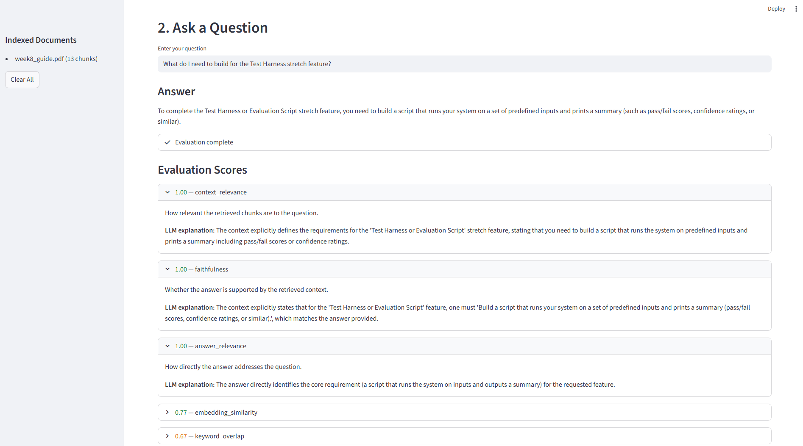
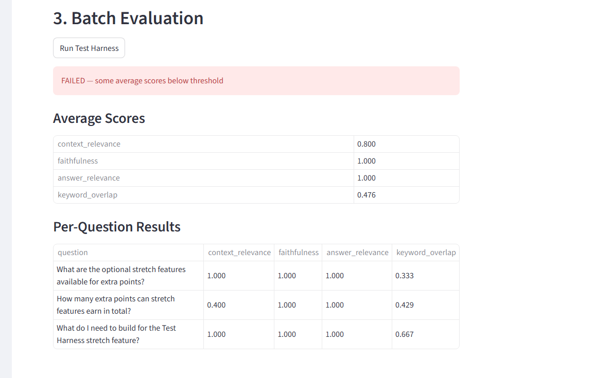

# Multi-Document RAG Evaluator

## Original Project

This project extends **DocuBot** (Module 4 tinker), a conversational document assistant that answered questions about a single uploaded PDF using a basic retrieval pipeline. The original system had no evaluation layer — it retrieved chunks and generated answers but provided no way to measure whether those answers were accurate, faithful, or relevant.

## Title and Summary

**Multi-Document RAG Evaluator** is an AI-powered document Q&A system with built-in quality evaluation. Users upload one or more PDF documents, ask questions in natural language, and receive answers generated from retrieved context. Every answer is automatically scored across four evaluation metrics using an LLM-as-judge approach, so users can see not just *what* the AI said, but *how trustworthy* that answer is.

## Architecture Overview

```
PDF Upload
    │
    ▼
[Ingestion] PyPDFLoader → RecursiveCharacterTextSplitter → GoogleGenerativeAIEmbeddings
    │                                                             │
    ▼                                                             ▼
[FAISS Vector Store] ←────────────────────────── stored to data/faiss_db/
    │
    ▼ (similarity search, k=4)
[Retriever] → top-k chunks
    │
    ▼
[Generator] gemini-2.0-flash → answer
    │
    ▼
[Evaluator]
    ├── context_relevance   (LLM-as-judge)
    ├── faithfulness        (LLM-as-judge)
    ├── answer_relevance    (LLM-as-judge)
    └── keyword_overlap     (heuristic)
    │
    ▼
[Streamlit UI] — displays answer + evaluation scores
```

The system is fully modular: `src/ingestion.py`, `src/retriever.py`, `src/generator.py`, and `src/evaluator.py` are independent components that can be tested and swapped individually. The `src/test_harness.py` runs batch evaluation over predefined questions and produces a pass/fail report.

## Project Structure

```
ai110-week8-project/
│
├── app.py                      # Streamlit UI — Upload PDFs, Ask a Question, Batch Evaluation
├── run_harness.py              # CLI script to run batch evaluation and print pass/fail report
├── debug_pipeline.py           # Dev script to test each pipeline stage from the terminal
├── requirements.txt            # Python dependencies
├── .env.example                # Template for GEMINI_API_KEY environment variable
│
├── src/
│   ├── ingestion.py            # Loads PDF, splits into chunks, embeds and stores in FAISS
│   ├── retriever.py            # Queries FAISS index with semantic similarity search
│   ├── generator.py            # Sends retrieved context + question to Gemini, returns answer
│   ├── evaluator.py            # LLM-as-judge metrics: context relevance, faithfulness, answer relevance, keyword overlap
│   └── test_harness.py         # Batch evaluation: runs pipeline over test_cases.json, aggregates scores
│
├── tests/
│   ├── conftest.py             # Loads .env so GEMINI_API_KEY is available during pytest
│   ├── test_ingestion.py       # Integration test — ingests real PDF, checks FAISS index created
│   ├── test_retriever.py       # Integration test — queries real FAISS index, checks results returned
│   ├── test_evaluator.py       # Unit tests — mocked LLM, verifies scoring logic and error handling
│   ├── test_generator.py       # Unit tests — mocked Gemini API, verifies prompt construction
│   └── test_test_harness.py    # Unit tests — mocked pipeline, verifies aggregation and pass/fail logic
│
├── data/
│   ├── pdfs/                   # Source PDFs to ingest (week8_guide.pdf included as sample)
│   ├── test_cases.json         # Predefined Q&A pairs used by the test harness
│   └── faiss_db/               # FAISS vector index (auto-created on first ingest)
│
└── assets/                     # Demo screenshots for README
```

## Demo Screenshots

**Initial state** — empty app with 3 sections: Upload PDFs, Ask a Question, Batch Evaluation.



**PDF selected** — `week8_guide.pdf` appears in the uploader and ingestion spinner starts.



**Ingestion in progress** — spinner active while the document is split into chunks, embedded, and stored in FAISS. Sections 2 and 3 are grayed out until complete.



**Answer + Evaluation** — answer shown with all 5 evaluation metrics. context_relevance, faithfulness, and answer_relevance all score 1.00; each expander shows the LLM's explanation.



**Batch Evaluation** — test harness results for 3 predefined questions showing per-question and average scores with pass/fail verdict.



## Setup Instructions

**Requirements:** Python 3.12, a Gemini API key

1. Clone the repository and enter the project folder:

   ```bash
   git clone <repo-url>
   cd ai110-week8-project
   ```
2. Create and activate a virtual environment (Python 3.12 required — Python 3.14 causes segfaults with Pydantic V1):

   ```bash
   python3.12 -m venv .venv
   # Windows:
   .venv\Scripts\activate
   # Mac/Linux:
   source .venv/bin/activate
   ```
3. Install dependencies:

   ```bash
   pip install -r requirements.txt
   ```
4. Create a `.env` file with your Gemini API key:

   ```
   GEMINI_API_KEY=your_key_here
   ```
5. Run the Streamlit app:

   ```bash
   streamlit run app.py
   ```
6. Run the test harness from the terminal:

   ```bash
   python run_harness.py
   ```
7. Run the test suite:

   ```bash
   pytest tests/ -v
   ```

## Design Decisions

**FAISS over ChromaDB:** ChromaDB 1.5.5 crashes natively on Windows (exit code 139) due to a known issue with its C++ bindings. FAISS (`faiss-cpu`) was chosen as a drop-in replacement — it is stable on Windows and supports the same similarity search interface via LangChain.

**LLM-as-judge evaluation:** Rather than requiring ground-truth labeled answers (which don't scale), the system uses Gemini to score each response. Three metrics (context relevance, faithfulness, answer relevance) are judged by the LLM; one (keyword overlap) is a fast heuristic that requires no API call.

**Modular architecture:** Each pipeline stage is an independent Python module with a single function. This makes it easy to swap components (e.g., replace the generator model, change the vector store) without touching the rest of the system. It also enables isolated unit testing.

**Python 3.12 requirement:** Pydantic V1 (used by LangChain internally) is incompatible with Python 3.14+, causing segfaults. Python 3.12 is the stable choice for this dependency stack.

**gemini-3.1-flash-lite-preview for all LLM calls:** Chosen for its higher free-tier quota and lower latency, while still producing quality responses for both generation and evaluation.

## Testing Summary

The project includes both unit/integration tests (`tests/`) and a batch evaluation harness (`run_harness.py`).


| Test file              | Approach                                   | Result     |
| ------------------------ | -------------------------------------------- | ------------ |
| `test_ingestion.py`    | Real API — ingests actual PDF             | 1/1 passed |
| `test_retriever.py`    | Real API — queries actual FAISS index     | 1/1 passed |
| `test_evaluator.py`    | Mocked LLM — tests scoring logic          | 8/8 passed |
| `test_generator.py`    | Mocked API — tests prompt construction    | 3/3 passed |
| `test_test_harness.py` | Mocked pipeline — tests aggregation logic | 4/4 passed |

**What worked well:** The modular design made it easy to isolate failures. When the embedding model returned 404 errors, only `test_ingestion.py` failed — the other tests were unaffected.

**What didn't work:** ChromaDB crashed with a native segfault on Windows — no Python-level error, just an exit code 139. This took significant debugging to identify since there was no stack trace.

**What I learned:** Integration tests (real API) catch different bugs than unit tests (mocked). The mock tests confirmed the pipeline logic was correct while the real API tests revealed model deprecation and quota issues.

## Reflection

This project showed that building a reliable AI system requires as much engineering discipline as ML knowledge. The hardest problems were not model-related, they were dependency compatibility (Python version vs Pydantic), platform-specific crashes (ChromaDB on Windows), and API deprecation (three embedding model names tried before finding one that worked).

Claude Code was used throughout this project. One helpful suggestion was identifying that `response.content` from the LLM was wrapped in markdown code fences (` ```json ... ``` `) rather than raw JSON — a subtle bug that caused all LLM-judge scores to silently return `None`. One flawed suggestion was recommending `text-embedding-004` as a replacement for the deprecated `embedding-001`, which also returned a 404, requiring a second round of debugging to find `gemini-embedding-001`.
